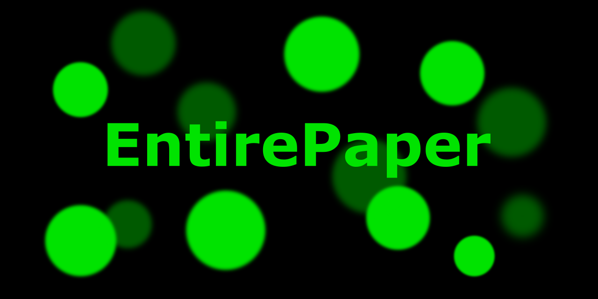

# EntirePaper

--
A lightweight and powerful Java wrapper for all PaperMC APIs (downloads, Hangar).

> **Warning**
> We do not recommend using EntirePaper in production until the first beta/stable release.

# Plans
Coming soon.

# Thanks

[JetBrains](https://www.jetbrains.com/) for [OSS development license](https://www.jetbrains.com/community/opensource/#support) and the best Java IDE!
